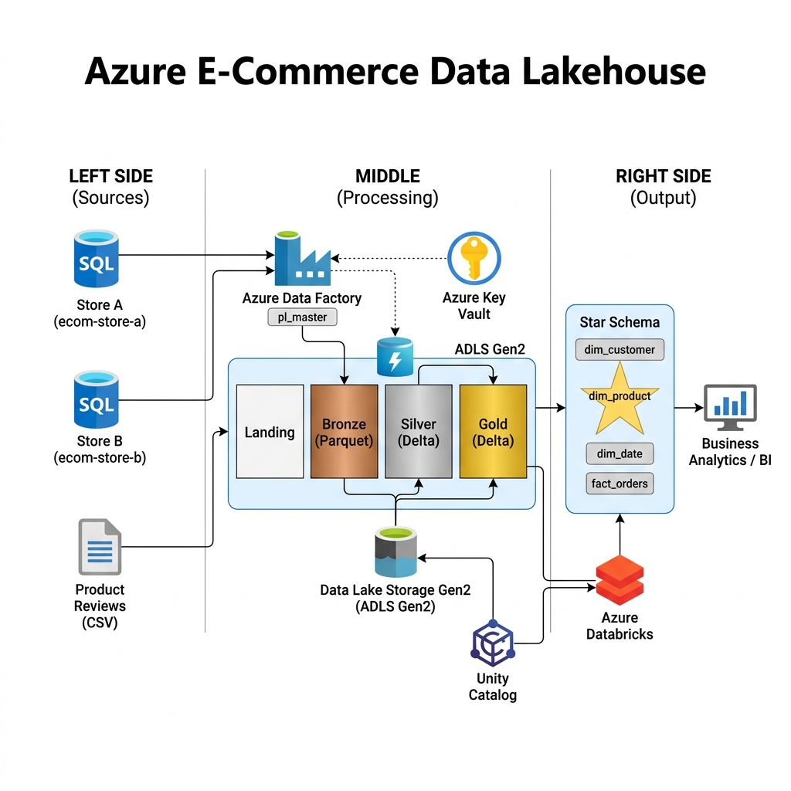

# E-Commerce Data Lakehouse Platform

A production-grade **end-to-end data engineering platform** built on Azure, implementing the **Medallion Architecture** (Bronze → Silver → Gold) for an e-commerce analytics use case.

This project ingests order data from **two regional stores with different schemas**, standardizes it through a **Common Data Model (CDM)**, applies **SCD Type 2** for slowly changing dimensions, and produces a **star schema** optimized for business intelligence.

---

## 🏗️ Architecture



### Tech Stack

| Component | Technology | Purpose |
|-----------|-----------|---------|
| **Orchestration** | Azure Data Factory | Master/child pipeline orchestration, metadata-driven ingestion |
| **Storage** | ADLS Gen2 | Landing, Bronze (Parquet), Silver (Delta), Gold (Delta) |
| **Processing** | Azure Databricks | PySpark transformations, CDM, SCD2, DLT |
| **Data Quality** | Delta Live Tables | Expectations-based quality enforcement in Gold layer |
| **Secret Management** | Azure Key Vault | ADF credential storage — zero hardcoded secrets |
| **Storage Access** | External Locations | Unity Catalog managed identity access to ADLS |
| **Governance** | Unity Catalog | Three-level namespace (catalog.schema.table) |
| **Deployment** | Databricks Asset Bundles | Dev/Prod deployment with service principal |
| **Alerting** | Logic Apps | Pipeline failure notifications |

---

## 📊 Data Sources & Schema Heterogeneity

One of the core challenges this project solves is **schema standardization across disparate source systems**.

### Store A — Azure SQL Database (`ecom-store-a`)
| Table | Key Columns | Load Type |
|-------|------------|-----------|
| `dbo.customers` | CustomerID, FirstName, LastName, Email, ... | Incremental (SCD2) |
| `dbo.products` | ProductID, ProductName, Price, Category, ... | Incremental (SCD2) |
| `dbo.orders` | OrderID, CustomerID, OrderDate, TotalAmount, ... | Incremental |
| `dbo.order_items` | OrderItemID, OrderID, ProductID, Quantity, ... | Incremental |
| `dbo.product_categories` | CategoryID, CategoryName, ParentCategory | Full |

### Store B — Azure SQL Database (`ecom-store-b`) — *Different Schema!*
| Table | Key Columns (different names!) | Load Type |
|-------|-------------------------------|-----------|
| `dbo.customer_info` | **CustID**, **FName**, **LName**, **EmailAddr**, ... | Incremental (SCD2) |
| `dbo.product_catalog` | **ProdID**, **ProdName**, **ListPrice**, **Cat**, ... | Incremental (SCD2) |
| `dbo.order_log` | **OrdID**, **CustID**, **OrdDate**, **GrandTotal**, ... | Incremental |
| `dbo.order_details` | **DetailID**, **OrdID**, **ProdID**, **Qty**, ... | Incremental |
| `dbo.product_categories` | **CatID**, **CatName**, **ParentCat** | Full |

### Flat File Source — Landing Container
| File | Description |
|------|-------------|
| `product_reviews.csv` | Customer reviews ingested as CSV from an external system |

---

## 🔄 Pipeline Flow

### Layer 1: Landing → Bronze (ADF)
```
┌─────────────────────────────────────────────────────────┐
│  pl_master (Master Pipeline)                            │
│                                                         │
│  ┌─────────────────────┐  ┌──────────────────────────┐  │
│  │ pl_source_to_bronze │  │ pl_landing_to_bronze     │  │
│  │                     │  │                          │  │
│  │ 1. Read config CSV  │  │ CSV → Parquet conversion │  │
│  │ 2. Filter active    │  │ (product reviews)        │  │
│  │ 3. ForEach (║ x5)   │  └──────────────────────────┘  │
│  │    ├── Archive old   │                               │
│  │    ├── Full/Inc load │  ┌──────────────────────────┐  │
│  │    └── Audit log     │  │ pl_bronze_to_silver      │  │
│  └─────────────────────┘  │ (Databricks notebooks)   │  │
│                            └──────────────────────────┘  │
│                            ┌──────────────────────────┐  │
│                            │ pl_silver_to_gold         │  │
│                            │ (Delta Live Tables)       │  │
│                            └──────────────────────────┘  │
└─────────────────────────────────────────────────────────┘
```

### Layer 2: Bronze → Silver (Databricks)
| Notebook | What It Does |
|----------|-------------|
| `customers.py` | Reads both stores → CDM mapping → Surrogate keys → Quality checks → **SCD Type 2** |
| `products.py` | Same pattern, tracks **price and category changes** via SCD2 |
| `orders.py` | CDM mapping → FK to customers → Incremental append |
| `order_items.py` | CDM + **discount normalization** (% vs fraction) → Incremental append |
| `product_categories.py` | CDM → **Full load** (small reference table) |
| `product_reviews.py` | From flat file source → Quality checks → Incremental append |

### Layer 3: Silver → Gold (Delta Live Tables)
| DLT Table | Type | Key Expectations |
|-----------|------|------------------|
| `dim_customer` | Dimension | `customer_key IS NOT NULL`, `Email IS NOT NULL` |
| `dim_product` | Dimension | `product_key IS NOT NULL`, `Price > 0` |
| `dim_date` | Dimension | **Generated** (not from source) — 2023 to 2026 |
| `dim_product_category` | Dimension | `category_key IS NOT NULL` |
| `fact_orders` | Fact | `order_key IS NOT NULL`, `FK_CustomerKey IS NOT NULL` |

---

## ⭐ Star Schema

```
                    ┌──────────────────┐
                    │   dim_customer   │
                    │                  │
                    │ customer_key (PK)│
                    │ FirstName        │
                    │ LastName         │
                    │ City, State      │
                    └────────┬─────────┘
                             │ FK
┌──────────────────┐   ┌─────┴──────────┐   ┌──────────────────┐
│   dim_product    │   │  fact_orders   │   │    dim_date      │
│                  │   │                │   │                  │
│ product_key (PK) │◄──│ FK_ProductKey  │   │ date_key (PK)    │
│ ProductName      │   │ FK_CustomerKey │──►│ full_date        │
│ Price            │   │ FK_DateKey     │   │ month, quarter   │
│ Category         │   │ Quantity       │   │ is_weekend       │
└──────────────────┘   │ LineTotal      │   │ fiscal_year      │
                       │ PaymentMethod  │   └──────────────────┘
                       │ OrderStatus    │
                       └────────────────┘
```

---

## 🔑 Key Engineering Decisions

| Decision | Rationale |
|----------|-----------|
| **CDM in Silver layer** | Two stores have different schemas — CDM ensures a unified model before any business logic |
| **SCD2 for dimensions only** | Customers/products change over time (address, price); orders are immutable transactions |
| **Full load for reference tables** | Product categories are small (~15 rows) — incremental overhead is unnecessary |
| **Audit table for watermarks** | Config-table based approach (vs JSON files) is industry standard and queryable |
| **Parallel ForEach (batch=5)** | Performance optimization — 10 tables processed in 2 batches instead of sequentially |
| **Archive before overwrite** | Bronze files are archived with date partitioning for full auditability |
| **Generated dim_date** | Standard DW practice — date dimensions are computed, not sourced |
| **DLT for Gold layer** | Built-in expectations, lineage tracking, and auto-optimization |
| **Quarantine, not drop** | Bad records are flagged (`is_quarantined`) for data steward review, not silently dropped |

---

## 🛡️ Security

- **Azure Key Vault**: ADF credentials (SQL connection strings, Databricks tokens) stored as secrets
- **Key Vault Linked Service**: ADF references secrets via Key Vault — zero hardcoded credentials
- **External Locations**: Unity Catalog manages ADLS access via Access Connector (managed identity) — no storage keys in code
- **Unity Catalog**: Table-level access control with `catalog.schema.table` governance
- **Service Principal**: Production DAB deployments use a service principal, not personal accounts

---

## 📁 Project Structure

```
E-commerce-Data-Lakehouse-Platform/
├── adf/
│   ├── datasets/                    # Parameterized datasets (SQL, Parquet, CSV, Delta)
│   ├── linked_services/             # Key Vault, SQL, ADLS, Databricks, Delta Lake
│   ├── pipelines/
│   │   ├── pl_master.json           # Master orchestration
│   │   ├── pl_source_to_bronze.json # Metadata-driven SQL → Bronze ingestion
│   │   ├── pl_landing_to_bronze.json# Flat file CSV → Bronze conversion
│   │   ├── pl_bronze_to_silver.json # Databricks notebook execution
│   │   └── pl_silver_to_gold.json   # DLT pipeline trigger
│   └── source_scripts/             # DDL + data load SQL scripts
├── configs/
│   └── load_config.csv             # Metadata-driven pipeline configuration
├── data_generator/                 # Faker-based realistic data generation
├── databricks/
│   ├── setup/                      # One-time setup (audit table DDL)
│   ├── utils/
│   │   ├── config.py               # Centralized configuration
│   │   └── transformations.py      # 8 reusable transformation functions
│   ├── src/
│   │   ├── silver/                 # CDM + Quality + SCD2 notebooks
│   │   └── gold/                   # DLT fact/dimension tables
│   ├── resources/                  # DAB pipeline + job YAML configs
│   ├── databricks.yml              # Asset Bundle config (dev/prod)
│   └── pyproject.toml              # Python project configuration
├── tests/                          # pytest unit tests for transformations
├── docs/                           # Architecture diagrams & documentation
└── README.md
```

---

## 🚀 Getting Started

See [docs/deployment_guide.md](docs/deployment_guide.md) for step-by-step setup instructions.

### Quick Start
1. **Azure Resources**: Create Resource Group, Storage Account (ADLS Gen2), ADF, Azure SQL (x2), Key Vault, Databricks Workspace
2. **Data Generation**: Run `python data_generator/generate_store_a.py` and `generate_store_b.py`
3. **SQL Setup**: Execute DDL scripts, then initial load scripts against both Azure SQL databases
4. **ADF Configuration**: Import linked services, datasets, and pipelines
5. **Databricks Setup**: Configure Unity Catalog, External Locations, and run `setup/audit_ddl.py`
6. **Deploy DAB**: `databricks bundle deploy -t dev`
7. **Run Pipeline**: Trigger `pl_master` in ADF

---

## 📈 Business Queries

The Gold layer supports real analytical queries. See [business_queries.sql](databricks/src/gold/business_queries.sql) for examples:

1. **Monthly Revenue Trend** — revenue and order count by month
2. **Top 10 Products by Revenue** — best-selling products with category breakdown
3. **Customer Lifetime Value** — top customers ranked by total spending
4. **Revenue by Category (Quarterly)** — category performance over time
5. **Payment Method Analysis** — average order value by payment type
6. **Store Comparison** — revenue comparison between Store A and Store B
7. **Weekend vs Weekday Sales** — sales pattern analysis

---

## 🧪 Testing

```bash
cd databricks
pip install -e ".[dev]"
pytest tests/ -v
```

---

## 👤 Author

**Anantha Sai Jinde**  
Data Engineer  
[LinkedIn](https://www.linkedin.com/in/jinde-anantha-sai/) | [GitHub](https://github.com/Ananth-Jinde)
