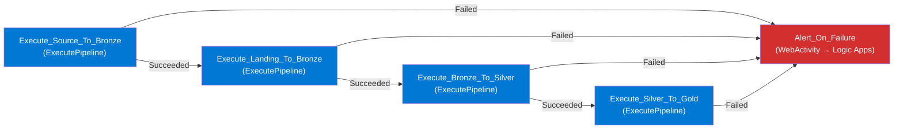
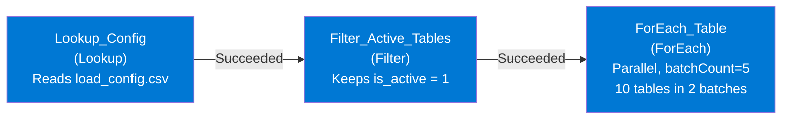
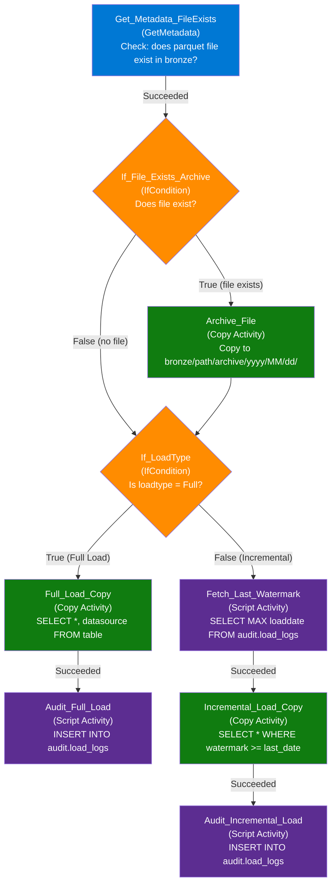
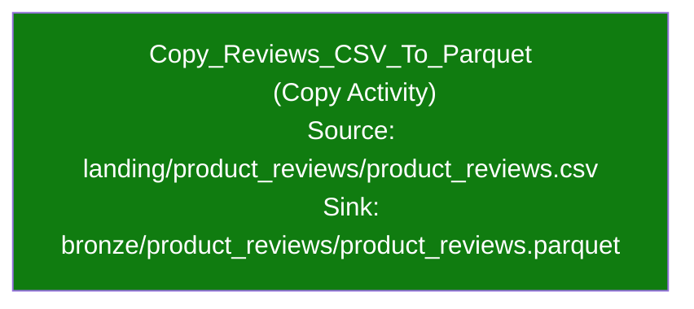
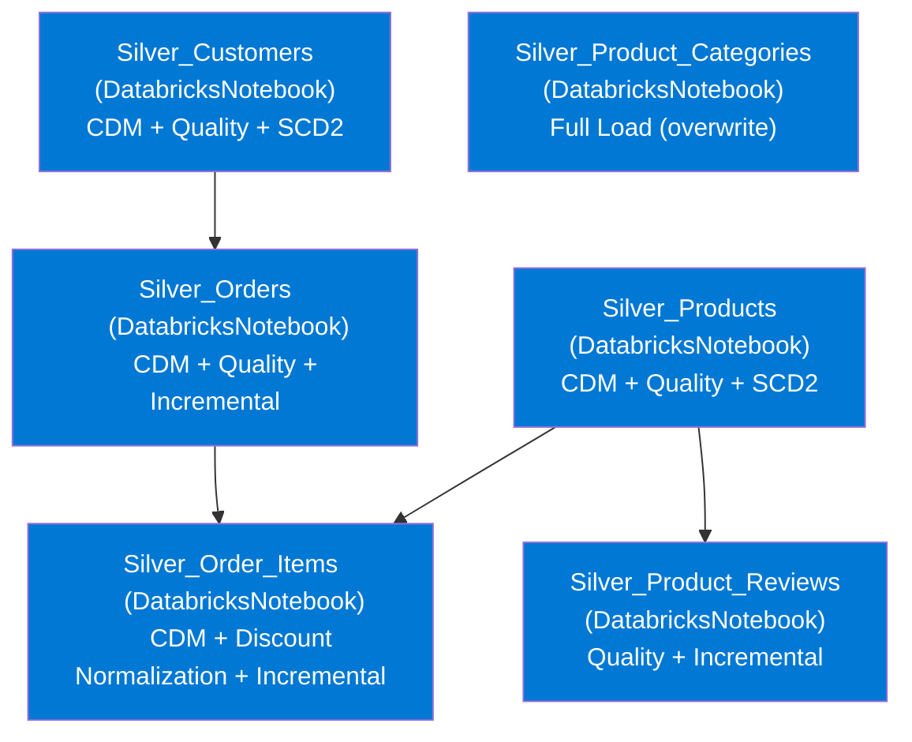
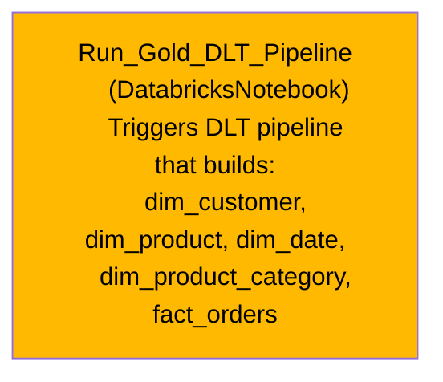
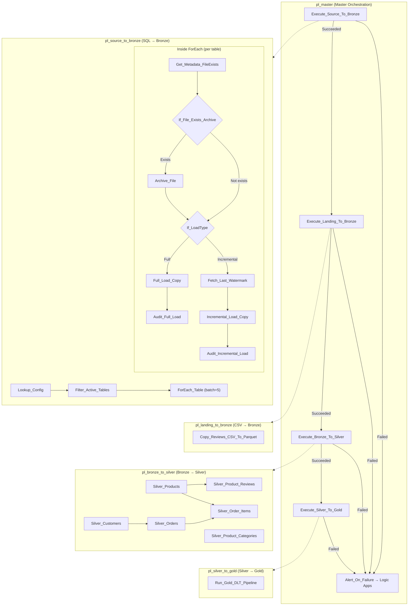

# ADF Pipeline Flow — Complete Visual Reference

> This document shows the exact activity flow for all 5 ADF pipelines, with activity names matching the actual JSON definitions.

---

## 1. pl_master — Master Orchestration Pipeline

This is the entry point. It runs 4 child pipelines in sequence. If ANY child fails, it sends a webhook alert to Logic Apps.

**Activities explained**:
| Activity Name | Type | What It Does |
|--------------|------|-------------|
| Execute_Source_To_Bronze | ExecutePipeline | Calls `pl_source_to_bronze` — waits for completion |
| Execute_Landing_To_Bronze | ExecutePipeline | Calls `pl_landing_to_bronze` — waits for completion |
| Execute_Bronze_To_Silver | ExecutePipeline | Calls `pl_bronze_to_silver` — waits for completion |
| Execute_Silver_To_Gold | ExecutePipeline | Calls `pl_silver_to_gold` — waits for completion |
| Alert_On_Failure | WebActivity | POSTs to Logic Apps webhook URL → sends Teams/email alert with pipeline name + run ID |

---

## 2. pl_source_to_bronze — Metadata-Driven SQL Ingestion

This is the most complex pipeline. It reads a config file, filters active tables, and uses a ForEach loop to process each table in parallel.

### Outer Flow (before ForEach)

### Inside ForEach — Activity Flow for EACH Table

**Activity color legend**: 🟦 Blue = Metadata/Filter | 🟧 Orange = If Condition | 🟩 Green = Copy Activity | 🟪 Purple = Script Activity

### Activities explained:
| Activity Name | Type | What It Does |
|--------------|------|-------------|
| Get_Metadata_FileExists | GetMetadata | Checks if `bronze/{targetpath}/{tablename}.parquet` already exists |
| If_File_Exists_Archive | IfCondition | If file exists → archive it. If not → skip to load. |
| Archive_File | Copy | Copies existing Parquet to `bronze/{targetpath}/archive/yyyy/MM/dd/{tablename}.parquet` |
| If_LoadType | IfCondition | Checks `item().loadtype == 'Full'` → branches to full or incremental |
| Full_Load_Copy | Copy | Runs: `SELECT *, 'store-a' AS datasource FROM dbo.customers` → writes Parquet |
| Audit_Full_Load | Script | `INSERT INTO audit.load_logs (data_source, tablename, numberofrowscopied, ...)` |
| Fetch_Last_Watermark | Script | `SELECT MAX(loaddate) FROM audit.load_logs WHERE data_source='store-a' AND tablename='dbo.customers'` |
| Incremental_Load_Copy | Copy | Runs: `SELECT *, 'store-a' AS datasource FROM dbo.customers WHERE ModifiedDate >= '2025-03-15'` → writes Parquet |
| Audit_Incremental_Load | Script | Same as Audit_Full_Load — logs rows copied and timestamp |

### Key points:
- **batchCount=5** means 5 tables process simultaneously. With 10 active tables, that's 2 batches.
- The **Script** activities run against `ls_delta_lake` linked service — they execute SQL on the Databricks audit table, NOT on the source SQL databases.
- The **Copy** activities use the parameterized `ds_azure_sql` (input) and `ds_parquet_bronze` (output) datasets.

---

## 3. pl_landing_to_bronze — Flat File Conversion

The simplest pipeline. One Copy activity converts CSV to Parquet.

**Activity**:
| Activity Name | Type | What It Does |
|--------------|------|-------------|
| Copy_Reviews_CSV_To_Parquet | Copy | Reads CSV from `landing` container → writes Parquet to `bronze/product_reviews/` |

---

## 4. pl_bronze_to_silver — Databricks Notebook Orchestration

Triggers 6 Databricks notebooks with a dependency graph. The notebooks that have no dependencies run in parallel. The ones with dependencies wait.

**Execution order** (determined by `dependsOn` in JSON):

| Execution Phase | Activities | Dependencies |
|----------------|-----------|-------------|
| Phase 1 (parallel) | Silver_Customers, Silver_Products, Silver_Product_Categories | None — all 3 start simultaneously |
| Phase 2 (after Phase 1) | Silver_Orders | Waits for Silver_Customers |
| Phase 2 (after Phase 1) | Silver_Product_Reviews | Waits for Silver_Products |
| Phase 3 (after Phase 2) | Silver_Order_Items | Waits for Silver_Orders AND Silver_Products |

**Why these dependencies?**
- `Silver_Orders` depends on `Silver_Customers` → because orders reference customer keys (FK)
- `Silver_Product_Reviews` depends on `Silver_Products` → because reviews reference product keys (FK)
- `Silver_Order_Items` depends on `Silver_Orders` AND `Silver_Products` → because order items reference both order keys and product keys (FKs)
- `Silver_Product_Categories` has NO dependencies → it's a standalone reference table

All 6 notebooks call `ls_databricks` linked service → which connects to the Databricks cluster.

---

## 5. pl_silver_to_gold — DLT Star Schema Build

Triggers a single Databricks notebook that runs the DLT/Declarative Pipeline to build the Gold star schema.

**Activity**:
| Activity Name | Type | What It Does |
|--------------|------|-------------|
| Run_Gold_DLT_Pipeline | DatabricksNotebook | Calls `/Repos/.../gold/run_gold_layer` which triggers the DLT pipeline. DLT builds all 5 Gold tables with quality expectations. |

---

## Complete End-to-End Flow (All 5 Pipelines Combined)

---

## Activity Type Reference

| Activity Type | Icon in ADF Studio | Purpose |
|--------------|-------------------|---------|
| ExecutePipeline | Blue rectangle with nested square | Calls another pipeline and waits for it |
| Lookup | Magnifying glass | Reads data from a dataset (returns rows) |
| Filter | Funnel | Filters rows based on a condition |
| ForEach | Loop arrows | Iterates over items (parallel or sequential) |
| GetMetadata | Info circle | Checks file properties (exists, size, etc.) |
| IfCondition | Diamond | Branches based on true/false expression |
| Copy | Two-page copy icon | Copies data from source dataset to sink dataset |
| Script | Document icon | Runs SQL script against a linked service |
| WebActivity | Globe icon | Sends HTTP request (used for Logic Apps webhook) |
| DatabricksNotebook | Databricks logo | Runs a notebook on a Databricks cluster |

---

## Linked Services Used

| Linked Service | Used By | Connects To |
|---------------|---------|------------|
| `ls_key_vault` | All other linked services | Azure Key Vault (stores all secrets) |
| `ls_azure_sql_store_a` | Copy activities (Store A tables) | Azure SQL Database `ecom-store-a` |
| `ls_azure_sql_store_b` | Copy activities (Store B tables) | Azure SQL Database `ecom-store-b` |
| `ls_adls_gen2` | Copy activities (Bronze read/write) | ADLS Gen2 storage account |
| `ls_delta_lake` | Script activities (audit table) | Databricks SQL endpoint (for audit.load_logs) |
| `ls_databricks` | DatabricksNotebook activities | Databricks workspace + cluster |

---

## Datasets Used

| Dataset | Type | Parameterized? | Used As |
|---------|------|---------------|---------|
| `ds_config_csv` | DelimitedText | No — fixed path to `configs/emr/load_config.csv` | Source for Lookup_Config |
| `ds_azure_sql` | AzureSqlTable | Yes — `SchemaName`, `TableName` parameters | Source for Copy activities (SQL → Parquet) |
| `ds_parquet_bronze` | Parquet | Yes — `Container`, `FolderPath`, `FileName` parameters | Sink for Copy activities (writes Parquet to ADLS) |
| `ds_delta_audit` | DeltaLakeTable | No — fixed to `audit.load_logs` | Used by Script activities for audit logging |
